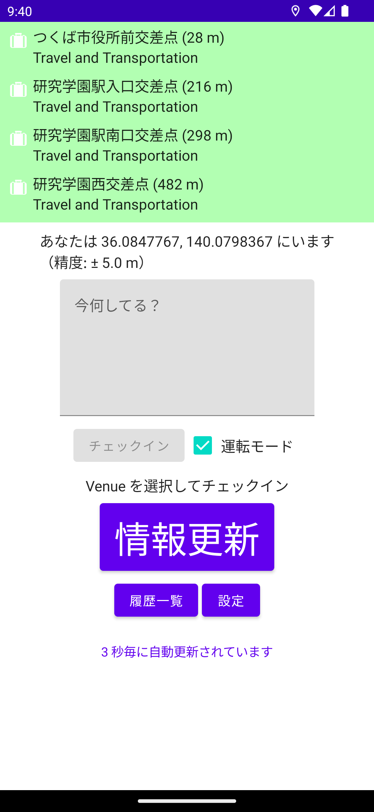
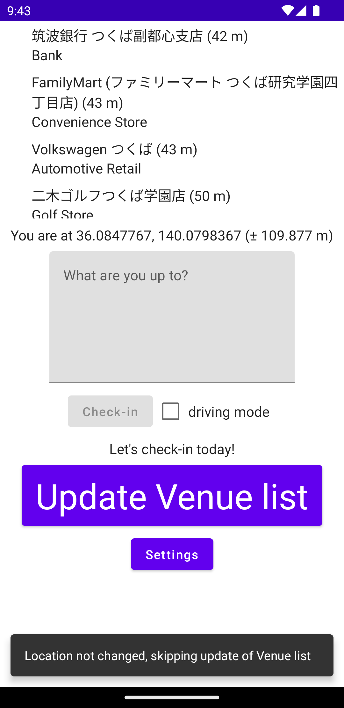
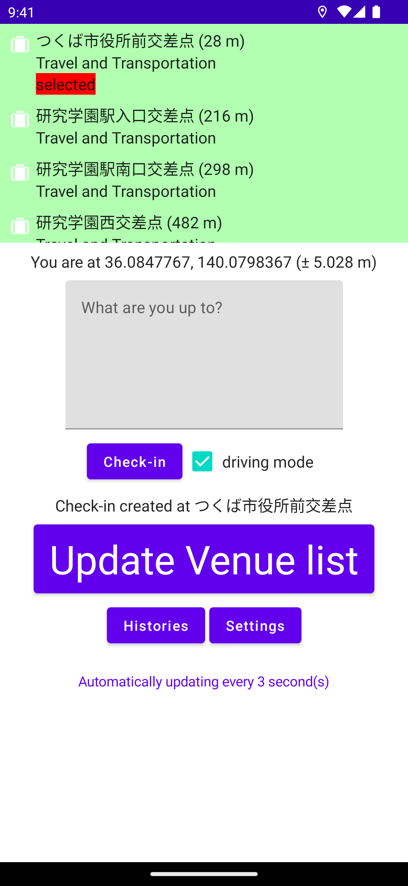

# Interschecin

交差点でのチェックインを補助するために作成された Swarm 利用者のための Android アプリケーション

## 機能

* 公式 Swarm アプリにある検索機能を省き、とにかく現在地周辺の Venue のみを表示することに徹しています
* 「運転モード」を有効化すると、「交差」が含まれる Venue を優先的に表示します
* 名前に「交差点」が含まれる Venue は背景が緑になって目立ちます
* アプリ別の言語設定がサポートされています（Android の App language 機能が使えます）
* 表示される Venue を長押しすることで、手軽にチェックインすることができます

## スクリーンショット

| ja  | en  | チェックイン |
| --- | --- | ---        |
|  |  |  |

## 使い方

初回起動時には、位置情報取得の許可（†1）と、Foursquare の API キー、OAuth token といった認証情報の設定（†2）をする必要があります。

認証情報は、自分で生成する必要があります。以下に参考となる資料へのリンクを掲載します。

* API キー
    * https://location.foursquare.com/developer/reference/places-api-get-started
* OAuth token
    * https://location.foursquare.com/developer/reference/authentication-v2

これらの認証情報を生成できたら、初回起動時に表示される以下の画面にそれぞれ入力します。

| 位置情報取得の許可をする画面（†1） | 認証情報を入力する画面（†2） |
| --- | --- |
|  |  |